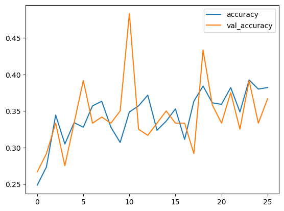
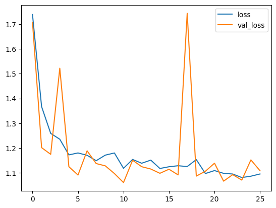
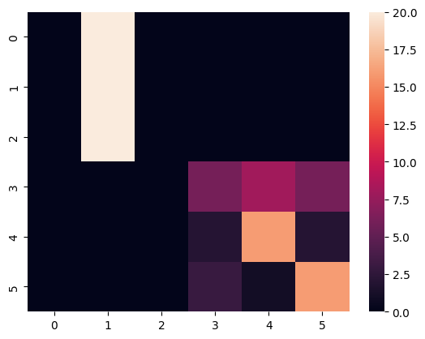

# Human Action Recognition

A deep learning project for **video-based human action recognition** using the KTH Action Recognition dataset. The notebook builds fixed-length video clips, trains a Keras-based video classification model, and evaluates performance with accuracy/loss curves and a confusion matrix.

## Project Overview

This project focuses on classifying short human action videos into six categories:

- Boxing
- Handclapping
- Handwaving
- Jogging
- Running
- Walking

The workflow includes:

- Downloading and organizing the KTH dataset
- Loading videos with OpenCV
- Sampling a fixed number of frames from each video
- Resizing frames to a common spatial resolution
- Building a deep learning video classifier in TensorFlow/Keras
- Evaluating predictions with training curves and a confusion matrix

## Dataset

The notebook uses the **KTH Action Recognition Dataset** through `kagglehub`.

### Classes used

- Boxing
- Handclapping
- Handwaving
- Jogging
- Running
- Walking

### Processed dataset shape

After preprocessing, the final clip tensor has shape:

```python
(599, 32, 120, 160, 3)
```

That means:

- 599 video clips
- 32 frames per clip
- Frame size of 120 × 160
- 3 color channels

## Model Summary

The notebook defines a Keras video classification model with:

- Total parameters: 785,222
- Trainable parameters: 784,774
- Non-trainable parameters: 448

The project uses:

- TensorFlow / Keras
- EarlyStopping
- ReduceLROnPlateau

## Training Setup

Key training choices from the notebook:

- Stratified train-test split
- Batch size: 6
- Maximum epochs: 2000
- Early stopping for better generalization
- Learning rate reduction on plateau

Since this is a video-based model, training is significantly more computationally expensive than standard image classification.

## Results

### Accuracy Curve



### Loss Curve



### Confusion Matrix



The model achieved **48% overall accuracy** on the KTH test set (120 samples, 6 action classes).

| Class            | Precision | Recall   | F1-Score | Support |
| ---------------- | --------- | -------- | -------- | ------- |
| 0 (boxing)       | 0.00      | 0.00     | 0.00     | 20      |
| 1 (handclapping) | 0.33      | 1.00     | 0.50     | 20      |
| 2 (handwaving)   | 0.00      | 0.00     | 0.00     | 20      |
| 3 (jogging)      | 0.55      | 0.30     | 0.39     | 20      |
| 4 (running)      | 0.64      | 0.80     | 0.71     | 20      |
| 5 (walking)      | 0.67      | 0.80     | 0.73     | 20      |
| **Macro Avg**    | **0.36**  | **0.48** | **0.39** | **120** |

The model performs well on locomotion actions (running, walking) but struggles with upper-body gestures (boxing, handwaving), which share similar spatial envelopes in fixed-length clips. This baseline demonstrates the challenge of clip-level classification without temporal attention mechanisms and motivates future work with LSTM or transformer-based temporal modeling.

## Repository Structure

```bash
human_action_recognition/
│── human_action.ipynb
│── requirements.txt
│── .gitignore
│── README.md
│── images/
│   ├── accuracy.png
│   ├── loss.png
│   └── conf_matrix.png
```

## How to Run

1. Clone the repository.
2. Install dependencies:

```bash
pip install -r requirements.txt
```

3. Open the notebook:

```bash
jupyter notebook human_action.ipynb
```

4. Run all cells to:

- download the dataset,
- preprocess videos into clips,
- train the model,
- and evaluate results.

## Highlights

- End-to-end video classification workflow
- Fixed-length clip generation from raw videos
- Deep learning for temporal visual recognition
- Evaluation using both curves and confusion matrix
- Strong portfolio project for computer vision and sequence modeling

## Future Improvements

- Try CNN-LSTM or Conv3D alternatives
- Increase dataset size or add augmentation
- Use transfer learning for spatial feature extraction
- Export the trained model for inference on unseen videos
